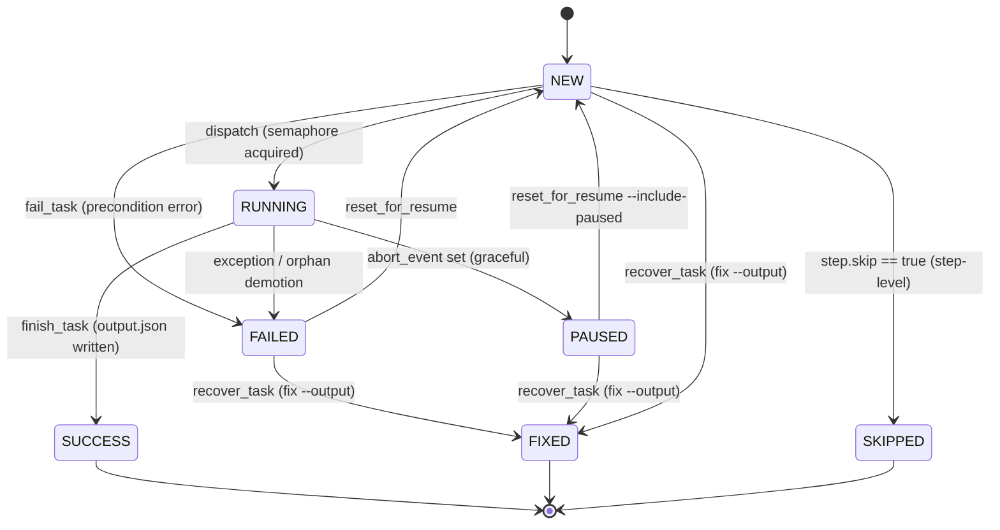

# Pipeline DAG Engine — 技术方案设计（V3）

> 评审记录：
> V1 → V2：强化 `fix --output` 的"跳过失败步骤继续执行"语义；双入口 BaseTask；工作目录默认 CWD + `--workspace`；`resume` 双模式；覆盖率 90%；支持多 Pipeline 并发。
> V2 → V3：CAD 示例具体化为可演示样板（§10），包含 7 个 mock 任务、混合双入口、进度推送、失败恢复演示。

**维护约定**：需求或设计变更时必须**同时更新 `spec.md` 和本文件**，保证两份文档同步。

---

## Context

构建一个与业务解耦的、基于 Python 3.10+ 的 DAG 任务编排命令行工具。用户用 YAML 描述工作流，引擎负责：YAML 解析与 schema 校验、DAG 合法性检查、任务并发调度、状态持久化、中止/恢复/断点续传、**通过补齐 output.json 跳过失败步骤继续执行**、多 Pipeline 并行运行、以及一个非阻塞的 REPL 监控界面。本设计仅作引擎本体，DXF 等业务任务作为外部插件存在。

---

## 已确认的关键决策

| 维度 | 选型 |
|---|---|
| 任务执行模型 | **async + 线程池兜底**：`BaseTask` 暴露 `async def execute()`；为 CPU 密集任务提供 `run_sync()` 钩子，引擎自动通过 `asyncio.to_thread` 卸载到线程池 |
| CLI 形态 | **REPL 优先 + 一次性子命令**：默认 `omnicad` 进入 REPL；同时支持 `omnicad run/lint/...` 一次性调用 |
| CAD 示例 | **作为可演示样板交付**：`pipelines/cad_identify_pipeline/` 提供 7 个 mock 任务（含 8s、10s 两个长时任务） |
| 工作目录 | **默认在 CWD 下** `./.pipeline_runs/...`；支持全局 `--workspace <path>` 自定义 |
| 多 Pipeline | **多实例并行**：单进程内多个 RunContext，各自独立 scheduler / state |
| 失败修复 | **fix --output 是核心机制**：补齐 output.json → 任务置 FIXED → 自动继续下游 |
| Resume 模式 | 默认仅重调度 Failed；`--include-paused` 同时调度 Paused |
| 测试覆盖率 | ≥ 90% |

---

## 1. 技术选型（含理由）

| 组件 | 库 | 理由 |
|---|---|---|
| 异步调度 | `asyncio` (stdlib) | 与 REPL 共享事件循环，零额外依赖 |
| 线程池兜底 | `asyncio.to_thread` (stdlib) | CPU 密集任务不阻塞事件循环 |
| DAG 算法 | `networkx >= 3.0` | 成熟稳定，提供 `is_directed_acyclic_graph`、`topological_sort`、`ancestors` |
| Schema 校验 | `pydantic >= 2.5` | 强类型、错误信息友好、v2 性能好 |
| YAML | `PyYAML >= 6.0` | 事实标准 |
| 终端 UI | `rich >= 13.0` | 进度条 / 表格 / 彩色日志，asyncio 友好 |
| 交互式 REPL | `prompt_toolkit >= 3.0` | 命令补全、历史、与 asyncio 原生集成（`PromptSession.prompt_async`） |
| 子命令解析 | `typer >= 0.12`（基于 click） | 类型安全的 CLI、自动生成 help |
| 测试 | `pytest >= 8.0` + `pytest-asyncio >= 0.23` + `pytest-cov` | 标准组合 |
| 文件原子写 | stdlib `os.replace` | 跨平台原子重命名 |

---

## 2. 项目目录结构

```
omnicad-2/
├── pyproject.toml
├── CLAUDE.md
├── spec.md                         # 需求规格（需求变更时同步更新）
├── design.md                       # 本文件（设计变更时同步更新）
├── pipeline_engine/                # 引擎本体（与业务解耦）
│   ├── __init__.py                 # 暴露 __version__
│   ├── __main__.py                 # `python -m pipeline_engine` 入口
│   ├── branding.py                 # CLI 品牌系统（logo / prompt / 颜色，从 config/branding.json 加载）
│   ├── i18n.py                     # 国际化引擎（init / t()，从 config/i18n/<lang>.json 加载）
│   ├── cli.py                      # typer 入口（一次性子命令）
│   ├── repl.py                     # prompt_toolkit + asyncio REPL
│   ├── repl_completion.py          # Tab 补全（COMMANDS 语法表 + 动态候选）
│   ├── models/
│   │   ├── pipeline_spec.py        # YAML schema 模型
│   │   └── runtime_state.py        # 运行时状态模型
│   ├── core/
│   │   ├── base_task.py            # BaseTask 抽象基类；暴露 self.logger
│   │   ├── plugin_loader.py        # 动态加载 module.ClassName
│   │   ├── yaml_parser.py          # YAML → Pydantic
│   │   ├── dag_validator.py        # NetworkX 校验 & 拓扑排序
│   │   ├── scheduler.py            # AsyncScheduler（单 run 调度）
│   │   ├── run_context.py          # RunContext：单次 run 的容器
│   │   ├── run_logger.py           # RunLogger：per-run 日志（FileHandler + ContextVar 隔离）
│   │   ├── run_manager.py          # RunManager：多 run 协调器
│   │   ├── state_manager.py        # StateManager（asyncio.Lock 保护）
│   │   ├── storage.py              # 工作目录读写、原子落盘、路径辅助
│   │   └── errors.py               # PipelineError 体系
│   ├── cli_json.py                 # emit / emit_error — 子命令 JSON 输出统一出口
│   └── builtin/
│       └── manual_data_loader.py   # skip 模式从 manual_data/ 加载
├── pipelines/                      # Demo pipeline 仓库（各自独立，与引擎解耦）
│   ├── cad_identify_pipeline/      # CAD 设备识别 + 成本估算（pipeline_id: cad_identify_cost_estimation）
│   │   ├── pipeline.yaml
│   │   ├── tasks.py                # 7 个 mock 任务，含进度推送与失败注入
│   │   ├── schemas.py
│   │   ├── mock_data/
│   │   │   ├── dxf_entities.json
│   │   │   └── recover_cable.json  # fix --output 恢复演示数据
│   │   └── README.md
│   └── cad_drawing_pipeline/       # CAD 自动出图示例（pipeline_id: cad_drawing_pipeline）
│       ├── pipeline.yaml
│       ├── tasks.py                # 6 个任务：覆盖 async/run_sync/InputModel/OutputModel/progress/skip/fail
│       ├── schemas.py
│       ├── mock_data/
│       │   ├── requirement.json
│       │   ├── floor_layout.json
│       │   ├── electrical_layout.json
│       │   └── refine_drawing/
│       │       └── output.json     # skip step 必需的预置输出
│       └── README.md
└── tests/
    ├── conftest.py
    ├── unit/
    │   ├── test_yaml_parser.py
    │   ├── test_dag_validator.py
    │   ├── test_plugin_loader.py
    │   ├── test_pipeline_spec.py
    │   ├── test_state_manager.py
    │   ├── test_state_migration.py
    │   ├── test_storage.py
    │   ├── test_base_task.py
    │   ├── test_manual_data_loader.py
    │   ├── test_run_logger.py      # RunLogger attach/detach/task_context/stdout 路由
    │   ├── test_run_manager.py     # instance_id 格式 + 冲突重试
    │   ├── test_cli.py
    │   ├── test_cli_autoload.py    # autoload 发现规则 / --no-autoload / env var / 坏 YAML 跳过
    │   └── test_cli_json_output.py # 每个子命令的 JSON 信封形状
    ├── integration/
    │   ├── test_scheduler.py
    │   ├── test_skip_mode.py
    │   ├── test_abort_resume.py
    │   ├── test_fix_command.py
    │   ├── test_multi_pipeline.py
    │   ├── test_cross_process_resume.py
    │   ├── test_state_guards.py
    │   ├── test_repl_commands.py
    │   ├── test_repl_autoload.py   # _autoload_pipelines 发现 / 幂等 / 失败跳过
    │   ├── test_repl_completion.py  # Tab 补全集成测试
    │   ├── test_repl_log_command.py # log 命令分页 / 过滤 / 补全
    │   ├── test_repl_rendering.py
    │   ├── test_output_channels.py  # task/step/pipeline output: MIRROR / aggregate
    │   └── test_shared_output_concurrent.py  # 并行 task 共享文件：accumulate / shared_json / YAML 校验
    └── e2e/
        ├── test_cad_example.py
        ├── test_cad_failure_recovery.py
        ├── test_cad_drawing_pipeline.py  # cad_drawing_pipeline 全流程 / skip / fail+fix
        └── test_run_logging.py           # run.log 生成、内容、ERROR 行、resume 追加
```

---

## 3. Pipeline YAML Schema

### 3.1 字段定义

```yaml
version: "1.0"
pipeline:
  id: cad_identify_cost_estimation          # 唯一标识，正则 [a-z][a-z0-9_]*
  name: "CAD 设备成本汇总"
  type: "CAD图识别及算量"            # 必填，业务分类标签（用于 list --pipeline 展示）
  description: "..."               # 可选
  max_parallelism: 4               # 全局并发上限；step 级可覆盖

steps:                             # 线性序列，按数组顺序执行
  - id: parse_dxf
    name: "解析 DXF"
    skip: false                    # true 时强制从 <workspace>/manual_data/<step_id>/output.json 加载
    max_parallelism: 2             # 可选，覆盖全局
    tasks:
      - id: read_dxf
        plugin: pipelines.cad_identify_pipeline.tasks.ReadDxfTask
        config:                    # 透传给任务的静态参数
          dxf_path: ./input.dxf
        inputs: {}                 # 静态输入（与上游产出合并）

      - id: parse_entities
        plugin: pipelines.cad_identify_pipeline.tasks.ParseEntitiesTask
        depends_on: [read_dxf]    # step 内任务级依赖

  - id: split_subgraph
    depends_on_steps: [parse_dxf] # 跨 step 依赖
    tasks:
      - id: split
        plugin: pipelines.cad_identify_pipeline.tasks.SplitSubgraphTask
        depends_on_steps: [parse_dxf]

  - id: recognize
    max_parallelism: 3
    tasks:                         # 三个任务无依赖，全部并行
      - { id: rec_building, plugin: ..., depends_on_steps: [split_subgraph] }
      - { id: rec_cable,    plugin: ..., depends_on_steps: [split_subgraph] }
      - { id: rec_schematic,plugin: ..., depends_on_steps: [split_subgraph] }

  - id: aggregate
    tasks:
      - id: merge
        plugin: pipelines.cad_identify_pipeline.tasks.MergeAndDedupTask
        depends_on_steps: [recognize]
```

### 3.2 依赖语义（含失败补齐机制）

- `depends_on: [task_id, ...]`：step 内任务级依赖。引擎读取上游 `output.json`，注入为 `inputs[task_id]`。
- `depends_on_steps: [step_id, ...]`：跨 step 依赖。引擎聚合该 step 所有叶子任务的产出，注入为 `inputs[step_id] = {task_id: output, ...}`。  
  **特例（skip=true 步骤）**：被跳过步骤没有任务产出文件，调度器改为直接读取 `<workspace>/manual_data/<step_id>/output.json` 的内容作为 `inputs[step_id]`，下游透明消费。
- 同 step 内无 `depends_on` 的任务全部并行（受 `max_parallelism` 限流）。
- **关键不变量：依赖就绪判定 = 上游 `output.json` 文件存在，与上游 status 字段无关**。这是 `fix --output` 跳过失败步骤的根基——output.json 被手动补齐后，下游即可消费。

---

## 4. Pydantic 数据模型

### 4.1 YAML schema 模型（`models/pipeline_spec.py`）

```python
from typing import Any
from pydantic import BaseModel, field_validator
import re

ID_PATTERN = re.compile(r"^[a-z][a-z0-9_]*$")

class TaskSpec(BaseModel):
    id: str
    plugin: str                              # "module.path.ClassName"
    depends_on: list[str] = []
    depends_on_steps: list[str] = []
    config: dict[str, Any] = {}
    inputs: dict[str, Any] = {}

    @field_validator("id")
    @classmethod
    def _check_id(cls, v): assert ID_PATTERN.match(v); return v

class StepSpec(BaseModel):
    id: str
    name: str | None = None
    skip: bool = False
    max_parallelism: int | None = None
    depends_on_steps: list[str] = []
    tasks: list[TaskSpec]

class PipelineMeta(BaseModel):
    id: str
    name: str
    type: str                        # 必填，业务分类（如"CAD图识别及算量"）
    description: str | None = None
    max_parallelism: int = 8

class PipelineSpec(BaseModel):
    version: str
    pipeline: PipelineMeta
    steps: list[StepSpec]
```

### 4.2 运行时状态模型（`models/runtime_state.py`）

```python
from enum import Enum
from datetime import datetime
from pydantic import BaseModel

class Status(str, Enum):
    NEW       = "new"         # 初始/待调度
    RUNNING   = "running"
    PAUSED    = "paused"
    SUCCESS   = "success"
    FAILED    = "failed"
    SKIPPED   = "skipped"     # step-level skip=true
    FIXED     = "fixed"       # 手动 fix --output 补齐后的任务状态

# 向后兼容：旧 state.json 中的 "pending"/"recovered" 在反序列化时自动映射
# _LEGACY_STATUS_MAP = {"pending": "new", "recovered": "fixed"}

class TaskState(BaseModel):
    id: str
    status: Status = Status.NEW
    progress: int = 0
    started_at: datetime | None = None
    finished_at: datetime | None = None
    error: str | None = None
    stack_trace: str | None = None
    input_path: str | None = None
    output_path: str | None = None
    log_path: str | None = None
    fixed_by: str | None = None       # 审计：记录 fix 操作信息（原 recovered_by）

class StepState(BaseModel):
    id: str
    status: Status = Status.NEW
    tasks: dict[str, TaskState] = {}
    started_at: datetime | None = None
    finished_at: datetime | None = None

class PipelineRunState(BaseModel):
    pipeline_id: str
    run_id: str
    status: Status = Status.NEW
    steps: dict[str, StepState] = {}
    started_at: datetime | None = None
    finished_at: datetime | None = None
    workspace: str
```

### 4.3 Task 状态机迁移图



> **说明**：
> - `recover_task`（等价于"置为 FIXED"）允许从 FAILED / PAUSED / NEW 进入 FIXED；源状态为 RUNNING 时抛 `PipelineError`（防止并发改写活跃任务）。
> - SUCCESS / FIXED / SKIPPED 为终态，`_assert_transition` 禁止再迁移。
> - PAUSED 由调度器 abort_event 路径内部产生；`stop` 命令面只暴露实例级中止。

---

## 5. BaseTask 接口（双入口）

```python
# pipeline_engine/core/base_task.py
from abc import ABC
from typing import Any, Awaitable, Callable
import asyncio

ProgressCallback = Callable[[int], Awaitable[None]]

class BaseTask(ABC):
    """所有用户任务必须继承此类。"""

    InputModel:  type | None = None   # 可选，声明后引擎自动校验
    OutputModel: type | None = None

    def __init__(self, task_id: str, config: dict[str, Any]) -> None:
        self.task_id = task_id
        self.config = config

    async def execute(self, inputs: dict[str, Any], progress: ProgressCallback) -> dict[str, Any]:
        """子类重载 run_sync 时，引擎自动通过 asyncio.to_thread 调度。"""
        if type(self).run_sync is not BaseTask.run_sync:
            return await asyncio.to_thread(self.run_sync, inputs, _SyncProgressAdapter(progress))
        raise NotImplementedError("子类必须实现 execute 或 run_sync 之一")

    def run_sync(self, inputs: dict[str, Any], progress) -> dict[str, Any]:
        """CPU 密集任务的同步入口，由引擎自动卸载到线程池。"""
        raise NotImplementedError
```

- 子类任选其一实现；
- `_SyncProgressAdapter` 用 `asyncio.run_coroutine_threadsafe` 把同步 progress 调用投回事件循环；
- `InputModel` / `OutputModel` 由引擎在 dispatch 前后用 Pydantic 校验，失败抛 `PipelineError`。

---

## 6. 引擎核心组件

### 6.1 RunContext（`core/run_context.py`）

封装单次 run 的全部上下文，是多 Pipeline 并行的核心抽象：

```python
class RunContext:
    pipeline_spec: PipelineSpec
    run_id: str
    workspace: Path
    scheduler: AsyncScheduler
    state_manager: StateManager
    abort_event: asyncio.Event
    main_task: asyncio.Task | None
```

每个 RunContext 拥有独立的 scheduler 和 state_manager，彼此无共享可变状态。

### 6.2 RunManager（`core/run_manager.py`）

进程级单例，协调所有 RunContext：

```python
class RunManager:
    _runs: dict[str, RunContext]           # key: run_id
    _registry: dict[str, PipelineSpec]     # key: pipeline_id
    _lock: asyncio.Lock

    async def load(self, yaml_path: Path) -> str
    async def start_run(self, pipeline_id: str, *, step=None, task=None) -> str
    async def stop(self, ref: str) -> None                             # 中止整个实例
    async def resume(self, run_id: str, *, include_paused=False) -> None
    async def fix(self, run_id: str, task_locator: str, *, input_path=None, output_path=None) -> None
    def list_pipelines(self) -> list[dict]        # 含 pipeline_id / type / name
    async def list_instances(self) -> list[dict] # 含 pipeline_id / instance_id / status
    def list_runs(self) -> list[RunSummary]       # 向后兼容保留
    def get_run(self, ref: str) -> RunContext      # ref = run_id 或 pipeline_id（歧义时报错）
```

**并发安全改进**：

- **H1（内存上界）**：`_runs` 最多保留 `_MAX_RUNS = 200` 条 entry；新 run 入 dict 时调用 `_prune_terminal_runs()`，按插入顺序驱逐最旧的终态 run（`is_active()==False`），RUNNING/PAUSED run 不受影响。
- **H3（snapshot 迭代）**：`list_instances()` 在 `async with self._lock:` 内先生成 `snap = list(self._runs.items())`，再出锁对快照进行 `await` 操作，避免迭代期间并发插入导致 `RuntimeError: dictionary changed size during iteration`。
- **H4/H9（原子赋值）**：`start_run()` 和 `resume()` 均在 `async with self._lock:` 内同时赋值 `ctx.abort_event` 和 `ctx.main_task`，保证外部不可观察到"abort_event 已替换但 main_task 仍是旧 Task"的中间态；`stop()` 也在同一 `_lock` 内读取并 set `abort_event`。
- **L1（TOCTOU 消除）**：`fix()` 的 `is_active()` 检查与 `_resolve_run()` 查找合并在同一 `async with self._lock:` 块内，消除并发 `resume()` 在两步之间启动 run 的竞态窗口。
- **M6（_resolve_run 加锁）**：`_resolve_run()` 要求调用方持有 `self._lock`（如 `stop()` 已满足）；无锁调用方改用 `async _get_ctx(ref)` — 该辅助函数内部加锁后调用 `_resolve_run`，确保对 `_runs` 的读取与 mutation 互斥。

### 6.3 AsyncScheduler（`core/scheduler.py`）

- NetworkX 构建 step 内与 step 间 DAG；
- `asyncio.Semaphore` 限流（步骤级 + 进程级两层）；
- 依赖就绪判定：上游 `output.json` 文件存在（status 无关）；
- dispatch：`asyncio.create_task(_run_task(...))`，完成后原子写盘 → 更新状态 → 触发下游；
- 监听 `abort_event`，触发后不再派发新任务，等 in-flight 任务自然结束。
- **H6（abort 优先级）**：`_dispatch_task` 的异常处理对所有异常类型（`asyncio.CancelledError` 和 `Exception`）均优先检查 `abort_event.is_set()`；若已 set，无论插件抛出何种异常（包括插件内部把 `CancelledError` 转换为 `PipelineError` 的情况），一律将任务置为 `PAUSED` 而非 `FAILED`，保证 `stop + resume` 语义一致。

### 6.4 StateManager（`core/state_manager.py`）

- 持有 `PipelineRunState`，所有读写走 `async with self._lock:`；
- 每次变更后立即调用 `storage.persist_state()`（原子写 `state.json`）；
- 每个 run 一个实例，彼此隔离。

**状态机非法迁移守卫**（V3.1 新增）：

| 方法 | 允许的 from 状态 | 其他状态时的行为 |
|---|---|---|
| `finish_task` | RUNNING | 静默丢弃（task 已 PAUSED/FIXED/SUCCESS） |
| `fail_task` | RUNNING、NEW | 静默丢弃（终态或 PAUSED 任务不可被改写） |
| `update_progress` | RUNNING | 静默丢弃（任务已停止/暂停时进度无意义） |
| `recover_task` | FAILED、PAUSED、NEW | RUNNING 时抛 `PipelineError`（H7：防止并发改写正在运行的任务）；置为 FIXED |
| `reset_for_resume` | FAILED（或 +PAUSED） | 仅允许声明的状态，其余无变化，目标状态 NEW |

> 注：`recover_task` 历史名沿用，等价于"将任务置为 FIXED"。

**孤儿 RUNNING 复位**（V3.1 新增）：

`demote_orphans_sync()` 同步方法（无锁，调用时 RunContext 尚未注册故无并发）：  
在 `restore_runs_from_disk` 加载旧 `state.json` 后立即调用，将残留的 RUNNING task / step / pipeline 全部置为 FAILED（`error="interrupted: process exited before completion"`），并原子写盘。这确保进程崩溃后的 `resume` 能正确重调度被中断的任务。

**I/O 解耦（H5）**：

所有状态变更在 `async with self._lock:` 内完成内存 mutate 后，出锁再通过 `_async_persist(snapshot)` 执行磁盘写入。`_async_persist` 持有独立的 `_persist_lock`（FIFO 顺序，确保写入顺序与 mutation 顺序一致），并通过 `asyncio.to_thread` 将同步 I/O 卸载到线程池，避免磁盘延迟阻塞事件循环。

**新增状态迁移守卫（M3）**：

| 方法 | 要求的 from 状态 | 其他状态时的行为 |
|---|---|---|
| `start_pipeline` | NEW | 抛 `PipelineError`（防止 SUCCESS→RUNNING 非法迁移） |
| `start_step` | NEW | 抛 `PipelineError`（同上） |
| `recover_task` | FAILED、PAUSED、NEW | RUNNING 时抛 `PipelineError`（防止并发 fix 改写活跃任务） |

**Resume 字段清零（H10）**：

`reset_pipeline_status(NEW)` 同时清除 `started_at` 与 `finished_at`（防止 UI 显示"状态=RUNNING、finished_at=过去时间"的矛盾状态）。`reset_for_resume` 同样清除 task 的 `error`、`stack_trace`、`started_at`、`finished_at`、`progress`。

**终态常量（M2）**：

```python
TERMINAL_PIPELINE_STATUSES: frozenset[Status] = frozenset({
    Status.SUCCESS, Status.FAILED, Status.PAUSED,
    Status.FIXED, Status.SKIPPED,
})
```

定义于 `models/runtime_state.py`，作为唯一事实来源（single source of truth）。SSE 端的 `_TERMINAL_STATUSES`（字符串集合）和 REST resume 端的 `_RESUME_BLOCKED_STATUSES` 均从此常量派生，不再各自硬编码。

### 6.5 Storage（`core/storage.py`）

工作目录结构（根目录由 `--workspace` 控制，默认 CWD）：

```
<workspace>/.pipeline_runs/
├── registry.json
└── <pipeline_id>/<run_id>/
    ├── pipeline_spec.yaml
    ├── state.json                  # 原子写，每次状态变更后刷新
    └── <step_id>/<task_id>/
        ├── input.json
        ├── output.json
        └── log.txt
```

关键方法：
- `atomic_write_json(path, obj)`：先写 `.tmp` 再 `os.replace`；
- `load_manual_data(step_id)`：从 `<workspace>/manual_data/<step_id>/output.json` 读取，缺失 → `PipelineError`；
- `fix_output(run_id, step_id, task_id, src_path)`：原子复制 src_path → 对应 output.json。

### 6.6 DAG Validator（`core/dag_validator.py`）

- `build_task_graph(step) -> nx.DiGraph`；
- `build_step_graph(pipeline) -> nx.DiGraph`（数组顺序 + `depends_on_steps`）；
- `is_directed_acyclic_graph` 校验，失败时用 `nx.find_cycle` 打印环路详情；
- 返回 `topological_generations`（同代可并行）。

### 6.7 PipelineError（`core/errors.py`）

```python
class PipelineError(Exception):
    def __init__(self, message: str, *, pipeline_id=None, step_id=None, task_id=None, cause=None): ...
```

引擎内部所有抛出均用此类；用户任务异常被引擎捕获并包装。

### 6.8 RunLogger（`core/run_logger.py`）

每次 pipeline run 对应一个 `RunLogger` 实例，将四类输出汇聚到 `<run_dir>/run.log`。

**日志文件路径**：`storage.get_run_log_path(workspace, pipeline_id, run_id)` → `<run_dir>/run.log`

**日志行格式**（固定列宽）：
```
2026-05-13T09:30:24.123Z  INFO   [export_dxf/validate         ]  task start
2026-05-13T09:30:24.456Z  ERROR  [export_dxf/validate         ]  DEMO_FAIL: 强制失败
```

**四源捕获**：
1. 引擎生命周期：`scheduler.run()` / `_dispatch_task()` 的显式 `run_logger.info/error(...)` 调用。
2. Python logging：`pipeline_engine.*` 所有 logger 通过 propagate 流入挂在 `pipeline_engine` 上的 `FileHandler`，由 `_RunFilter` 按 `_run_id_var` 隔离。
3. Task 自定义：`BaseTask.logger = logging.getLogger(f"pipeline_engine.task.{task_id}")`，天然继承同一 FileHandler。
4. stdout/stderr：全局替换为 `_RunAwareStream`，根据 `_run_id_var` 将 write() 路由到对应 run 的 logger；无 run 上下文时透传原始流。

**多 run 隔离**：两个模块级 `contextvars.ContextVar` — `_run_id_var`（run 粒度）、`_task_ctx_var`（task 粒度）。asyncio Task 的 copy-on-write 语义确保并发 run 之间不共享 ContextVar 值。

**生命周期**：`scheduler.run()` 入口调用 `attach()`（设 contextvar + 挂 FileHandler + 初始化 stdout wrapper），`finally` 块调用 `detach()`（移除 handler + 关闭 fd）。resume 走相同路径，FileHandler 以 `mode="a"` 追加，日志连续。

**`_buffers` 清理（L2）**：`detach()` 在移除 FileHandler 后，从 `sys.stdout` 和 `sys.stderr` 的 `_RunAwareStream._buffers` dict 中 `pop` 当前 `run_id` 的条目，防止 serve 模式下长期运行时每个 run 残留一个 buffer entry 造成无界增长。

**`task_context(step_id, task_id)`**：同步 contextmanager，在 `_dispatch_task` 中以 `with` 包裹 task 执行段；进入时打 "task start"，正常退出打 "task done"，异常退出打 "task failed"（并 re-raise 供外层 `fail_task` 处理）。

**防递归三层防线**（解决两条已复现的无限递归路径）：
1. `_RunAwareStream.write()`/`flush()` 加 `threading.local` 可重入 guard；嵌套进入时一律 fall-through 到 `_original` 流，杜绝任意触发源的递归。
2. `attach()` 设 `pipeline_engine.propagate = False`，阻止 record 冒泡到 root，杜绝 `pytest --log-cli` / `logging.basicConfig()` / 第三方库注册的 `StreamHandler` 把记录写回 wrapped stderr（路径 A）。
3. `_RunFileHandler.handleError` 直接写 `_original_stderr`，不经 wrapper——防止 `FileHandler` I/O 故障时 emit → handleError → wrapper.write → emit 的死循环（路径 B）。

### 6.9 Autoload（`cli.py:_autoload_pipelines`）

CLI 启动时（REPL 与所有一次性子命令）自动扫描 `<base_dir>/*/pipeline.yaml` 并注册。

**发现规则**：`base_dir.glob("*/pipeline.yaml")`，一级深度。`base_dir` 解析优先级：
1. 全局选项 `--pipelines-dir DIR`（或 env `PIPELINE_AUTOLOAD_DIR`）
2. 默认 `Path.cwd() / "pipelines"`

**禁用开关**：`--no-autoload`（或 env `PIPELINE_NO_AUTOLOAD`），或 `base_dir` 不存在时静默。

**失败处理**：单个 YAML 解析失败 → 跳过，写 WARNING 到 stderr；不影响其余文件及子命令 exit code。`_autoload_pipelines(rm, base_dir)` 返回 `list[{path, pipeline_id, ok, error?}]`。

**集成点**：`_bootstrap(rm, ctx, restore_runs, restore_writeback)` 先调 `_reload_registry`（从 registry.json 恢复历史注册），再调 `_autoload_pipelines`；`rm.load` 幂等，两者顺序明确。REPL 模式在 `run_repl()` 进入 prompt 循环前调用，并打印"已加载 N 个 pipeline"摘要。新增子命令须依据是否需写回，显式选择 `restore_writeback=True`（仅 resume/fix）或默认 `False`（查询类命令）。

**REPL 会话隔离**：REPL bootstrap 调用 `svc.bootstrap(restore_runs=False, restore_writeback=False)`。`restore_runs=False` 确保只重建 pipeline spec 注册表（用于 `start` 补全）而不从磁盘恢复旧 run 实例；Tab 补全的 instance_id 候选列表因此仅包含当前 REPL 会话启动的 run，避免历史遗留实例污染上下文菜单。

### 6.10 JSON 输出模块（`cli_json.py`）

所有一次性子命令通过此模块统一格式化输出，REPL 路径不涉及。

**信封格式**：
- 成功：`{"ok": true, "command": "<cmd>", ...payload}`
- 失败：`{"ok": false, "command": "<cmd>", "error": {"message": "...", "type": "PipelineError", "pipeline_id": null, ...}}`

**核心函数**：
- `emit(command, **payload)`：`typer.echo(json.dumps(..., indent=2))`，成功路径。
- `emit_error(command, exc)`：同样输出到 stdout（保证 AI Agent 可一次 `json.loads(stdout)` 拿到结构化错误），返回 `typer.Exit(1)` 供调用方 raise。
- `parse_log_line(raw)` / `read_json_file(path)` / `read_log_tail(path, tail)`：`log` / `inspect` 子命令的内联序列化辅助。

**设计约定**：autoload 警告写 stderr；所有正式输出（成功或失败 envelope）写 stdout，**默认 `indent=2`** 格式化，便于人工阅读；`json.loads()` 仍正常解析多行 JSON，不影响 AI Agent 调用。`inspect` 含 `task.input` / `task.output`（内联小 JSON）和 `task.log_tail`（最后 100 行字符串数组）；`status` 通过 `PipelineRunState.model_dump(mode="json")` 直接序列化，不手写字段。

### 6.11 只读恢复模式（`restore_writeback`）

**背景**：CLI 一次性子命令（如 `status`）通过 `restore_runs_from_disk()` 从磁盘重建 RunContext。原始实现在重建时无条件调用 `demote_orphans_sync()`，将所有 RUNNING 状态强制降为 FAILED 并写回 `state.json`。当 REPL 正在另一进程中运行同一个 pipeline 时，CLI 的查询请求会污染正在进行中的 run 状态（"跨进程状态污染" bug）。

**解决方案**：在 `restore_runs_from_disk(write_back: bool = True)` 增加 `write_back` 参数，结合 `_bootstrap(restore_writeback)` 参数控制各命令行为：

| 命令 | `restore_runs` | `restore_writeback` | 说明 |
|------|---------------|--------------------|----|
| `status`, `inspect`, `log`, `list --instance`, `stop` | `True` | `False` | 只读：不改写磁盘 |
| `resume`, `fix` | `True` | `True` | 写回：降级孤儿后重调度 |
| `start`, `load`, `lint` | `False` | N/A | 不恢复旧 run |

**不变式**：`resume` 和 `fix` 仍需 `write_back=True`，确保跨进程崩溃后的孤儿 RUNNING 状态被正确识别为 FAILED 并可重调度。

---

### 6.12 View-Model 共享层（`view_model.py`）

**背景**：CLI JSON 输出（`status` / `inspect`）和 REPL 终端渲染（`_render_status` / `_render_task_detail`）原先各自直接从 runtime state 对象读取字段，字段子集与转换逻辑在两处各自硬编码，存在长尾发散风险。

**模块职责**：`pipeline_engine/view_model.py` 提供 Pydantic 表示层，作为 runtime state 到两个渲染目标的统一中间层。CLI 和 REPL 均通过 builder 函数取得 view 对象后再做各自的序列化/渲染，不直接调用 `state.model_dump()` 或手工构造展示字典。

**核心类（均为 Pydantic `BaseModel`）**：

| 类 | 对应 runtime model | 用途 |
|----|--------------------|------|
| `TaskStatusView` | `TaskState` | 摘要（status 命令 / REPL 表格） |
| `StepStatusView` | `StepState` | 同上，嵌套 `dict[str, TaskStatusView]` |
| `PipelineStatusView` | `PipelineRunState` | 同上，嵌套 `dict[str, StepStatusView]` |
| `TaskDetailView` | `TaskState` + 读穿字段 | inspect --task / REPL 详情 |

**透明性不变式（Transparency Invariant）**：

```
∀ state: PipelineRunState:
    build_pipeline_status_view(state).model_dump(mode="json") == state.model_dump(mode="json")
```

View 类的字段集合、字段顺序与对应 runtime model 完全一致，由 `model_validate(state.model_dump())` 保证。`test_view_model.py` 中的透明性测试是机械化验证此不变式的回归护栏。

**Builder API**：

| 函数 | 输入 | 说明 |
|------|------|------|
| `build_task_status_view(ts)` | `TaskState` | 摘要级视图 |
| `build_step_status_view(ss)` | `StepState` | 递归构建嵌套 TaskStatusView |
| `build_pipeline_status_view(state)` | `PipelineRunState` | 递归构建完整视图树 |
| `build_task_detail_view(ts, log_tail_size=100)` | `TaskState` + size | 详情视图，含 input/output/log_tail 读穿 |

**log_tail_size 差异**：CLI 路径传 `log_tail_size=100`（默认）；REPL 路径传 `log_tail_size=200`，以便更详细的交互式调试。差异通过参数显式体现，不再分散于两套实现中。

与 §6.10（JSON 输出模块 / indent=2）和 §6.11（只读恢复模式）共同构成 CLI 输出层的三条设计约束。

---

### 6.13 结果输出通道（`output:` 字段）

**背景**：task 的内部 output.json 路径包含随机 run_id，外部系统无法稳定消费；step/pipeline 层级原本没有持久化的聚合结果文件，依赖数据仅在内存中临时聚合后路由。`output:` 字段允许用户在 YAML 中显式声明三个层级的结果落盘路径。

**字段定义**：`output: PATH`（字符串，可选，默认 `None`），在 `TaskSpec` / `StepSpec` / `PipelineMeta` 三处均支持。路径解析规则：相对路径相对 workspace 解析（`storage.resolve_output_path`）；绝对路径原样使用；不支持模板插值。

**三层语义**：

| 层级 | 触发时机 | 写入内容 | 错误处理 |
|---|---|---|---|
| Task | task `RUNNING → SUCCESS`，写完内部 output.json 之后 | 与内部 output.json 字节级一致（MIRROR） | OSError → WARNING，task 仍记 SUCCESS |
| Step（普通） | step 完成且 `success=True` | `{task_id: <task_output>}`（叶子 task 聚合，同 `_collect_step_outputs`） | OSError → WARNING，step 仍记 SUCCESS |
| Step（skip+output） | `_handle_skip` 校验阶段（读取，不写） | 作为预置 step output 读取路径，替代 `manual_data/<step_id>/output.json` | 路径不存在 → PipelineError |
| Pipeline | `run()` 末尾 `all_ok=True` | `{step_id: <step_aggregated_dict>}` | OSError → WARNING，pipeline 仍记 SUCCESS |

**MIRROR 语义**（task 级）：内部 `.pipeline_runs/<pipeline_id>/<run_id>/<step_id>/<task_id>/output.json` 是权威源，resume / dependency 解析 / fix / inspect 均不受影响。用户路径是额外的对外副本，不进入 `TaskState.output_path`（该字段仍指向内部路径）。

**skip step 回退逻辑**：若 step 未设 `output:`，保持原行为（读 `manual_data/<step_id>/output.json`），零破坏回退。

**调用位置**：

| 位置 | 函数 | 新增逻辑 |
|---|---|---|
| `scheduler._dispatch_task` (~line 305) | task mirror 写入 | `resolve_output_path` + `atomic_write_json` |
| `scheduler._run_step` (~line 218) | step aggregate 写入 | 复用 `_collect_step_outputs` |
| `scheduler.run` (~line 84) | pipeline aggregate 写入 | 遍历所有 step 调 `_collect_step_outputs` |
| `scheduler._handle_skip` (~line 206) | skip + output 路径校验 | 取代 `load_manual_data` 校验 |
| `scheduler._collect_step_outputs` (~line 365) | skip + output 路径读取 | 优先 output 路径，回退 manual_data |

与 §6.5（Storage）的 `resolve_output_path` / `atomic_write_json` 配合；不影响 §6.12（view-model）透明性，因为 `output:` 是 spec 层字段，不进入 runtime state。

---

### 6.14 并行任务共享文件安全（Shared Output Safety）

#### 问题背景

同一 Step 内的多个 Task 通过 `asyncio.gather` 并发执行。当它们都声明了相同的 `output: PATH` 时，引擎的 MIRROR 写入（`atomic_write_json`）是同步调用（无 `await`），asyncio 单线程模型使写入本身序列化，不会产生字节级文件损坏。但**最后完成的 Task 会静默覆盖之前 Task 的写入结果**，造成数据丢失。

同样，如果 Task 代码在 `execute()` 中直接对共享文件执行**读-改-写**（read-modify-write），读取和写入之间若有 `await` 挂起点，另一个并发 Task 可能在此间隙读取到旧数据并覆写——经典 TOCTOU 竞争。

#### 双重保护机制

```
Pipeline YAML 加载时（StepSpec 模型校验）
         ↓
  ┌──────────────────────────────────────────────────────────┐
  │  check_shared_output_paths() validator                   │
  │                                                          │
  │  Task A: output="results/shared.json"  ← 相同路径？       │
  │  Task B: output="results/shared.json"                    │
  │                                                          │
  │  两者 output_mode 均为 "accumulate"？                      │
  │       YES → 合法，继续加载                                  │
  │       NO  → ValidationError（加载即报错，阻止运行）          │
  └──────────────────────────────────────────────────────────┘
         ↓（仅 accumulate 模式才允许共享路径）

运行时（AsyncScheduler._do_mirror_write）

  Task A 完成          Task B 完成          Task C 完成
       │                    │                    │
       ▼                    ▼                    ▼
  acquire lock        acquire lock          acquire lock
  (per-path           (same lock,           (same lock,
   asyncio.Lock)       blocks)               blocks)
       │                    │                    │
  read shared.json    read shared.json      read shared.json
  {} → {A: out_A}     {A:…} → {A:…,B:…}    {A,B:…} → {A,B,C:…}
  atomic_write()      atomic_write()        atomic_write()
  release lock        release lock          release lock

最终 shared.json = {"task_a": {...}, "task_b": {...}, "task_c": {...}}
```

#### 任务代码中的直接写入（shared_json API）

当 Task `execute()` 内部需要直接读改写共享文件（不通过 YAML `output:` 通道），使用 `BaseTask.shared_json()` 上下文管理器：

```
Task A execute()                   Task B execute()
─────────────────────────────      ─────────────────────────────
async with self.shared_json(path)  await some_computation()
    as data:                            ↓
  # 持有锁：Task B 在此被阻塞          async with self.shared_json(path)
  data["a_result"] = my_val                as data:
  # 离开 with → 原子写回                # Task A 释放锁后才进入
                                       data["b_result"] = my_val
```

`shared_json()` 使用与 `_do_mirror_write` 相同的 `self._path_locks` 注册表（由 `AsyncScheduler` 注入），确保引擎写入和任务直接写入共享同一把锁，不会相互竞争。

#### output_mode 语义

| `output_mode` | 行为 | YAML 约束 |
|---|---|---|
| `overwrite`（默认） | 整体覆写目标文件；per-path 锁确保序列化（写入本身原子，无内容合并） | 同一 Step 内只能有一个 Task 写此路径，否则 ValidationError |
| `accumulate` | 持锁读现有内容 → 合并 `{task_id: output}` → 原子写回 | 同一路径的所有 Task 均须声明此模式，否则 ValidationError |

#### 关键实现位置

| 文件 | 位置 | 职责 |
|---|---|---|
| `pipeline_engine/models/pipeline_spec.py` | `StepSpec.check_shared_output_paths` | YAML 加载时校验；ValidationError 阻止 run |
| `pipeline_engine/core/scheduler.py` | `AsyncScheduler._path_locks` | 运行时 per-path lock 注册表（run-scoped） |
| `pipeline_engine/core/scheduler.py` | `_do_mirror_write()` | 持锁执行 MIRROR / ACCUMULATE 写入 |
| `pipeline_engine/core/base_task.py` | `BaseTask.shared_json()` | 任务代码安全读改写 API |
| `pipeline_engine/core/storage.py` | `load_json_safe()` | 文件不存在时返回 None（用于 accumulate 初始读取） |

**注意**：`run_sync()` 同步任务运行在线程池中，`asyncio.Lock` 无法从线程中 `await`，`shared_json()` 仅适用于 `async execute()` 任务。需要共享文件写入的同步任务应改写为 `async execute()`。

#### 验证覆盖

集成测试文件：`tests/integration/test_shared_output_concurrent.py`（5 个场景，434 个测试总计）

| 测试函数 | 验证内容 |
|---|---|
| `test_three_parallel_tasks_accumulate_into_shared_file` | 3 个不同延迟的并行 task（模拟 `recognize` step）→ 结果文件包含全部 3 个 task key，无数据丢失 |
| `test_accumulate_order_independent` | 反转延迟顺序（不同 task 先完成）→ 结果仍然完整 |
| `test_shared_json_accumulates_list_from_parallel_tasks` | 3 个 task 通过 `shared_json()` 追加到共享列表 → 列表包含全部 3 项 |
| `test_yaml_validation_blocks_shared_path_without_accumulate` | 未声明 `output_mode: accumulate` 的共享路径 → 加载即 `ValidationError` |
| `test_single_task_overwrite_unchanged` | `output_mode: overwrite`（默认）单 task → 文件内容为 task 输出本身，不含 task_id 包装 |

**test 1 运行时输出示例**（3 个并行识别任务，延迟 0.03 / 0.01 / 0.02 s，完成顺序 cable → schematic → building）：
```json
{
  "rec_cable":     { "entity_type": "cable",     "count": 5, "entities": ["cable_0", ...] },
  "rec_schematic": { "entity_type": "schematic", "count": 4, "entities": ["schematic_0", ...] },
  "rec_building":  { "entity_type": "building",  "count": 2, "entities": ["building_0", "building_1"] }
}
```
若无锁 + accumulate，最后完成的 `rec_building` 会静默覆盖前两者，文件中只剩 `{"entity_type": "building", ...}`。

---

### 6.15 HTTP REST API（`pipeline_engine/api/`）

FastAPI 应用由 `pipeline_engine/api/app.py` 的 `create_app(svc)` 工厂创建，挂载两个路由组：

| 路由模块 | 前缀 | 内容 |
|---|---|---|
| `routers/pipelines.py` | — | `POST /lint`、`POST /pipelines`（load）、`GET /pipelines`（list） |
| `routers/runs.py` | — | `POST /runs`（start 异步）、`GET /runs`、`GET /runs/{id}`（status）、`:stop`、`:resume`、`/tasks/{step}/{task}:fix`、`/log`、`/steps/{step}` |
| `routers/events.py` | — | `GET /runs/{id}/events`（SSE 流） |

**响应信封**：所有端点通过 `schemas.envelope_ok(command, **payload)` / `schemas.envelope_err(command, message, type, **payload)` 构造响应，保证与 CLI JSON 子命令的 `{ok, command, ...}` 格式一致（L3）。

**SSE 端点（M4）**：`run_events` handler 在 `try/finally` 内 `subscribe/unsubscribe`（H2），确保客户端断开时队列不泄漏。主循环以 `asyncio.wait_for(q.get(), timeout=25.0)` 驱动，超时发心跳 `: heartbeat\n\n`；每次迭代开头检查 `await request.is_disconnected()` 快速退出。SSE 终态集合从 `TERMINAL_PIPELINE_STATUSES` 派生（M2）。

**C2 守卫**：REST `:resume` 端点在调用 `cmd_resume` 前检查 run 状态；若处于 `_RESUME_BLOCKED_STATUSES`（SUCCESS / FIXED / SKIPPED）则抛 `PipelineError(422)`，防止重复执行有副作用的任务。FAILED / PAUSED 可正常 resume。

**非阻塞 resume（H2）**：`:resume` 通过 `cmd_resume(wait=False)` 触发后台 `asyncio.Task` 后立即返回 `202 Accepted`，响应体仅含 `{"resumed": run_id}`，不含 `final_status`（与 `POST /runs` 的 202 模式一致）。`cmd_resume` 新增 `wait: bool = True` 参数：CLI 路径传 `wait=True`（默认）仍阻塞到完成并返回 `final_status`；REST 路径传 `wait=False` 立即返回。客户端通过 `GET /runs/{run_id}` 或 SSE 跟踪进度。

**serve 工作区互斥（L4）**：`omnicad serve` 启动时在 `.pipeline_runs/.serve.lock` 上调用 `fcntl.flock(LOCK_EX | LOCK_NB)` 获取排他锁；同一 workspace 的第二个 serve 进程立即以 exit code 1 退出并打印错误，进程结束后锁自动释放。

**目录结构**：
```
pipeline_engine/api/
├── __init__.py          # create_app 工厂
├── app.py               # FastAPI 应用组装 + lifespan
├── schemas.py           # 请求 Pydantic 模型 + envelope_ok/envelope_err
└── routers/
    ├── pipelines.py
    ├── runs.py
    └── events.py
```

### 6.16 CLI 品牌系统（`pipeline_engine/branding.py`）

负责加载 `config/branding.json`，并在 REPL 入口渲染启动横幅。

#### 配置加载流程

```
omnicad (bare) ──▶ main() callback
                     │
                     └── ctx.invoked_subcommand is None?
                           │
                           ├── yes ──▶ run_repl(workspace, ...)
                           │               │
                           │               └── load_branding()
                           │               └── print_banner(console, cfg, workspace=ws)
                           │               └── REPL 主循环（prompt: "{cfg.prompt}> "）
                           │
                           └── no  ──▶ subcommand handler
                                       （stdout = 纯 JSON，无横幅）
omnicad lint x.yaml ─────────────────┘
```

当 `config/branding.json` 缺失时，`load_branding()` 返回内置默认值（`_BUNDLED_DEFAULT`），REPL 仍可正常启动。

#### Schema（`config/branding.schema.json`，Draft 2020-12）

| 字段 | 类型 | 必填 | 默认值 | 说明 |
|---|---|---|---|---|
| `name` | string | ✓ | — | CLI 内部标识（信息性；二进制名由 `pyproject.toml` 决定） |
| `display_name` | string | ✓ | — | 横幅中的人类可读名称 |
| `prompt` | string | ✓ | — | REPL 提示符根字符串（自动追加 `> `） |
| `version` | string | ✓ | — | 版本字符串；`"@auto"` 从包元数据推导 |
| `description` | string | ✓ | — | 横幅副标题 |
| `logo` | string | — | `""` | 多行 ASCII logo（`\n` 分隔行），空字符串禁用 |
| `logo_style` | string | — | `light_steel_blue1` | Rich 样式，作用于 logo 字形 |
| `border_style` | string | — | `grey50` | Rich 样式，作用于 Panel 边框 |
| `tagline_style` | string | — | `grey70` | Rich 样式，作用于版本 / 描述行 |
| `box_style` | enum | — | `ROUNDED` | Panel 形状：`ROUNDED` / `HEAVY` / `DOUBLE` / `SQUARE` / `MINIMAL` |

#### 默认调色板

| 元素 | Rich 样式 | 选择理由 |
|---|---|---|
| Logo 字形 | `light_steel_blue1` | 低饱和度蓝白，深色/浅色终端均不刺眼 |
| 边框 | `grey50` | 中灰色——细腻边框，不与 logo 争夺视觉焦点 |
| 副标题 | `grey70` | 浅灰——次要信息明显降权 |

#### 渲染效果

Logo 文本通过 `Align.center()` 居中后嵌入 `rich.panel.Panel`；`cwd:` 行渲染在 Panel 外部（不拥挤品牌区块）：

```
╭───────────────────────────────────────────────────────────────╮
│                                                               │
│    ██████╗ ███╗   ███╗███╗   ██╗██╗ ██████╗ █████╗ ██████╗    │
│   ██╔═══██╗████╗ ████║████╗  ██║██║██╔════╝██╔══██╗██╔══██╗   │
│   ██║   ██║██╔████╔██║██╔██╗ ██║██║██║     ███████║██║  ██║   │
│   ██║   ██║██║╚██╔╝██║██║╚██╗██║██║██║     ██╔══██║██║  ██║   │
│   ╚██████╔╝██║ ╚═╝ ██║██║ ╚████║██║╚██████╗██║  ██║██████╔╝   │
│    ╚═════╝ ╚═╝     ╚═╝╚═╝  ╚═══╝╚═╝ ╚═════╝╚═╝  ╚═╝╚═════╝    │
│                                                               │
│                      OmniCAD  v0.1.0                          │
│         DAG-based CAD workflow orchestration engine           │
│                                                               │
╰───────────────────────────────────────────────────────────────╯
  cwd: /home/user/dev/omnicad-2
```

---

### 6.17 i18n 架构（`pipeline_engine/i18n.py`）

薄翻译引擎，管理运行时语言选择与字符串查找。

#### 语言解析流程

```
omnicad (任意调用) ──▶ cli.py 顶部 i18n.init() 执行
                         │
                         ├── lang 参数？ ──▶ 使用该值
                         ├── OMNICAD_LANG env var？ ──▶ 使用该值
                         ├── config/i18n.json 存在？ ──▶ 读取 language 字段
                         ├── 系统 locale? ──▶ zh_* → zh_CN, en_* → en
                         └── 后备 ──▶ zh_CN

                    _load(<lang>) ──▶ config/i18n/<lang>.json
                         │
                         └── 若当前语言 ≠ zh_CN：用 zh_CN 补齐缺失键
                               （增量翻译安全）

t("some.key") ──▶ _translations.get("some.key", "some.key")
                         │
                         └── 若 i18n 未初始化 ──▶ 自动调用 init()（懒初始化）
```

#### 扩展点

新增语言只需在 `config/i18n/` 下放置 `<locale>.json`：

```
config/i18n/
  zh_CN.json     ← 简体中文（规范语言，所有键必须存在）
  en.json        ← English
  ja.json        ← （未来）日本語 —— 只需存放此文件，无需改代码
```

缺失键自动回退 `zh_CN`，支持增量翻译（新键先出现在 zh_CN，等翻译好再添加到其他语言文件）。

#### 翻译键命名规范

| 前缀 | 作用域 |
|---|---|
| `cli.*` | `cli.py` 中 Typer 的 `help=` 字符串 |
| `repl.help.*` | REPL `help` 命令输出中的命令描述 |
| `repl.label.*` | 状态标签、列标题、结果前缀 |
| `repl.err.*` | 错误消息 |
| `repl.warn.*` | 警告消息（含 `{n}` 等占位符） |
| `repl.success.*` | 操作成功消息 |
| `repl.usage.*` | 命令用法格式串 |
| `repl.table.*` | Rich Table 标题 |
| `repl.col.*` | Rich Table 列标题 |
| `repl.log.*` | 日志浏览相关消息 |
| `repl.info.*` | 空列表提示等信息消息 |

含动态变量的键使用 Python `str.format()` 占位符，例如：

```json
"repl.warn.exit_active_runs": "{n} 个 run 仍在运行，退出后将被放弃。"
```

```python
t("repl.warn.exit_active_runs").format(n=len(active))
```

#### API 与 branding 作用域

| 内容 | 是否受 i18n 影响 |
|---|---|
| `--help` 文本、REPL 提示 / 错误 / 标签 | ✓ |
| `config/branding.json`（用户自定义品牌） | ✗ 由用户直接管理 |
| JSON 响应信封（键名：`ok`、`command` 等） | ✗ 固定 English（程序化接口） |

---

## 7. CLI / REPL 指令

### 7.1 全局参数

```
omnicad [--workspace PATH] [--pipelines-dir DIR] [--no-autoload] <subcommand>
```

| 全局选项 | env var | 默认值 | 说明 |
|---|---|---|---|
| `--workspace / -w` | — | CWD | 工作目录 |
| `--pipelines-dir` | `PIPELINE_AUTOLOAD_DIR` | `./pipelines` | Autoload 扫描目录 |
| `--no-autoload` | `PIPELINE_NO_AUTOLOAD` | 关闭（默认开启 autoload） | 禁用 autoload |

### 7.2 一次性子命令（JSON 输出）

所有子命令默认输出 JSON（扁平 + `ok` 字段信封）到 stdout；失败时 exit code = 1。

```
omnicad                                         # 进入 REPL（Rich 渲染）
omnicad load <path> [<path>...]
omnicad lint <path>
omnicad list [--pipeline]                       # 列已注册 pipeline
omnicad list --instance                         # 列运行实例
omnicad start <pipeline_id> [--step S] [--task T]
omnicad stop <instance_id>
omnicad resume <instance_id> [--include-paused]
omnicad status <instance_id>
omnicad inspect <instance_id> [--step S] [--task T]
omnicad fix <instance_id> --task T [--output PATH] [--input PATH]
omnicad log <instance_id> [--tail N] [--offset N] [--all] [--errors-only]
```

`start` 始终阻塞等待所有 run 完成（H8：`--no-wait` 已移除；在单进程 CLI 中 event loop 退出会立即取消后台 Task，`--no-wait` 语义从根本上无法实现）。`resume` 同样阻塞到完成。后台（非阻塞）执行仅在 `serve` 模式下支持：`POST /runs` 和 `POST /runs/{id}:resume` 均立即返回 202 并由服务端驱动运行，客户端通过 `GET /runs/{id}` 或 SSE 跟踪进度。

> **start 与 stop 的对称性**：`start` 支持 `--step/--task` 细粒度启动；`stop` 只接受 instance_id，中止整个 run。task 级 PAUSED 状态由调度器 abort_event 路径内部生产，不作为用户接口。

### 7.3 REPL 指令

| 指令 | 行为 |
|---|---|
| `load <path>` | 解析 YAML → 校验 → 注册 |
| `list [--pipeline]` | 列已注册 pipeline（pipeline_id / type / name） |
| `list --instance` | 列运行实例（pipeline_id / instance_id / status） |
| `start <id> [--step S] [--task T]` | 后台启动，立即返回 run_id |
| `stop <instance_id>` | 触发 abort_event（中止整个实例） |
| `resume <instance_id> [--include-paused]` | 默认仅调度 Failed；加 `--include-paused` 同时调度 Paused |
| `status <instance_id>` | Rich 表格输出全貌 |
| `status --all` | 所有活跃 pipeline 实例总览 |
| `status <instance_id> --watch` | Rich Live 实时刷新（显式触发，避免抢屏） |
| `inspect <instance_id> --step S --task T` | 输出 input.json / output.json / log.txt / stack_trace |
| `fix <instance_id> --task T --output PATH` | 补齐 output.json → FIXED → 自动触发下游 |
| `fix <instance_id> --task T --input PATH` | 写入 input.json → New，等 resume 调度 |
| `log <instance_id> [--tail N] [--offset N] [--all] [--errors-only]` | 分页显示 run.log；默认最后 100 行；ERROR 行红色高亮 |
| `clear` | 清屏（发 ANSI escape，REPL 提示符随后出现在顶部） |
| `exit` | 退出；有活跃 pipeline 实例时提示 |

非阻塞实现：REPL 主协程跑 `PromptSession.prompt_async()`；`start` 通过 `asyncio.create_task` 派发。

### 7.4 REPL 命令补全

#### 架构

```
PromptSession
  └── ThreadedCompleter          ← 在后台线程执行补全，不阻塞 asyncio 事件循环
        └── PipelineReplCompleter(rm)
              ├── 实时读 rm._registry   → pipeline_id 候选
              └── 实时读 rm._runs       → instance_id 候选
```

`PipelineReplCompleter` 实现于 `pipeline_engine/repl_completion.py`，继承 `prompt_toolkit.completion.Completer`。

#### 命令语法表（COMMANDS）

| 命令 | 位置参数 kind | flag-with-value | 布尔 flag |
|---|---|---|---|
| `load` | `path` | — | — |
| `list` | — | — | `--pipeline`, `--instance` |
| `start` | `pipeline_id` | `--step`→`step_id`, `--task`→`task_ref` | `--wait` |
| `stop` / `resume` / `status` / `inspect` / `fix` | `ref`（instance_id） | `fix`: `--task`→`task_ref`, `--output`/`--input`→`path`; `start`/`inspect`: `--step`→`step_id`, `--task`→`task_ref` | 各命令自有 |
| `log` | `ref`（instance_id） | `--tail`→`num`, `--offset`→`num` | `--all`, `--errors-only` |

#### 动态候选 & display_meta

| kind | 候选来源 | display_meta | 排序 |
|---|---|---|---|
| `pipeline_id` | `rm._registry.keys()` | `<type> \| <name>` | 字母升序 |
| `ref` (instance_id) | `rm._runs.keys()` | `pipeline=<pid> \| status=<status>` | 按 run_id 内嵌时间戳**倒序**（`run_id.rsplit("_", 2)[1]`）；最新 run 优先 |
| `step_id` | 从已输入的 pipeline_id/ref 反查 `_registry[pid].steps` | `step #<N>` | spec 定义顺序 |
| `task_ref` | 同上；若已输入 `--step <id>` 则仅列该 step 的任务（裸 task_id，无 `step_id/` 前缀）；否则以 `step_id/task_id` 全量展示 | `task in <step>` | spec 定义顺序 |
| `path` | 委托 `PathCompleter` | PathCompleter 接管 | 文件系统顺序 |

`ref → pipeline_id` 反查：直接读取 `rm._runs[run_id].pipeline_id`，不做字符串解析（instance_id 格式 `<pipeline_id>_yyyyMMdd-hhmmss_<4digit>` 中 pipeline_id 本身可能包含 `_`，字符串分割有歧义）。

#### 降级策略
- `_registry` / `_runs` 为空 → 对应 kind 返回空候选，不抛错。
- `state_manager._state.status.value` 不可读 → `display_meta` 显示 `status=?`。
- 拼错命令名 → 不补任何值。
- `complete_while_typing=True`：边输入边触发联想；Tab 翻页选择。

---

## 8. 多 Pipeline 并发模型

- 单事件循环、单进程，所有 RunContext 共用；
- 进程级 `asyncio.Semaphore(cpu_count())` 跨 run 限流线程池；
- `pipeline_id` 寻址歧义时强制使用 `run_id`；
- 进程重启后可从磁盘 `state.json` 恢复并 `resume`。

---

## 9. fix --output 完整流程

假设 `recognize` step 下的 `rec_cable` 任务失败：

1. `inspect <run_id> --step recognize --task rec_cable` → 查看堆栈；
2. 外部生成符合 `RecognizeOutput` schema 的 `recover.json`；
3. `fix <run_id> --task rec_cable --output ./recover.json`：
   - 用 `OutputModel` 校验（若已声明）；
   - 原子复制为工作目录下的 `recognize/rec_cable/output.json`；
   - task status → `FIXED`，`fixed_by` 记录审计信息；
4. `resume <run_id>`：
   - 调度器检测到 `rec_cable.output.json` 存在 → 依赖就绪；
   - 下游 `aggregate/merge` 被调度，消费补齐产出；
   - Pipeline 继续至完成。

---

## 10. CAD Pipeline 示例

### 10.1 目标

1. **功能验证**：覆盖串行 step、step 内并行、长时任务、进度推送、状态机转换、fix 修复。
2. **观感验证**：Rich 进度条流畅、REPL 非阻塞、`status --watch` 实时刷新。
3. **参考样板**：业务方构建新 pipeline 的完整参考实现。

### 10.2 任务清单与耗时

| Step | Task | plugin 类 | 入口 | 耗时 | 进度推送 |
|---|---|---|---|---:|---|
| `parse_dxf` | `read_dxf` | `ReadDxfTask` | `run_sync` | 2s | 每 200ms |
| `parse_dxf` | `parse_entities` | `ParseEntitiesTask` | `execute` | 3s | 每 300ms |
| `split_subgraph` | `split` | `SplitSubgraphTask` | `run_sync` | 2s | 每 200ms |
| `recognize` | `rec_building` | `RecBuildingTask` | `run_sync` | **8s** | 每 800ms |
| `recognize` | `rec_cable` | `RecCableTask` | `execute` | **10s** | 每 1s |
| `recognize` | `rec_schematic` | `RecSchematicTask` | `run_sync` | 6s | 每 600ms |
| `aggregate` | `merge` | `MergeAndDedupTask` | `execute` | 2s | 每 200ms |

`recognize` step 三任务并行，总耗时应 ≈ 10s（非 24s）——这是并行调度的关键验收点。

### 10.3 schema（`pipelines/cad_identify_pipeline/schemas.py`）

```python
from pydantic import BaseModel

class Entity(BaseModel):
    id: str; layer: str; type: str
    bbox: tuple[float, float, float, float]

class ReadDxfOutput(BaseModel):
    file_path: str; entity_count: int; raw_path: str

class ParseEntitiesOutput(BaseModel):
    entities: list[Entity]

class Subgraph(BaseModel):
    id: str; bbox: tuple[float, float, float, float]; entity_ids: list[str]

class SplitSubgraphOutput(BaseModel):
    subgraphs: list[Subgraph]

class RecognizedItem(BaseModel):
    category: str; name: str; count: int; subgraph_id: str

class RecognizeOutput(BaseModel):
    items: list[RecognizedItem]

class CostSummaryItem(BaseModel):
    category: str; name: str; total_count: int; unit_price: float; subtotal: float

class MergeOutput(BaseModel):
    summary: list[CostSummaryItem]; grand_total: float
```

### 10.4 mock 任务样板（`pipelines/cad_identify_pipeline/tasks.py` 节选）

```python
import time, asyncio
from pipeline_engine.core.base_task import BaseTask
from .schemas import ReadDxfOutput, RecognizeOutput

class ReadDxfTask(BaseTask):
    OutputModel = ReadDxfOutput

    def run_sync(self, inputs, progress):
        for i in range(10):
            time.sleep(0.2)
            progress(int((i + 1) / 10 * 100))
        return {"file_path": self.config["dxf_path"], "entity_count": 1234, "raw_path": "..."}

class RecCableTask(BaseTask):
    """长时 async 任务，模拟 10s 识别调用。"""
    OutputModel = RecognizeOutput

    async def execute(self, inputs, progress):
        for i in range(10):
            await asyncio.sleep(1.0)
            await progress((i + 1) * 10)
        return {"items": [
            {"category": "cable", "name": "YJV-4x16", "count": 42, "subgraph_id": "sg_1"},
            {"category": "cable", "name": "YJV-3x10", "count": 18, "subgraph_id": "sg_2"},
        ]}
```

`PIPELINE_DEMO_FAIL=<task_id>` 环境变量让指定任务抛错（供演示和 e2e 测试用）。
`PIPELINE_DEMO_FAST=1` 将所有 sleep × 0.1（CI 加速）。

### 10.5 演示脚本

```bash
# ── 一次性子命令（JSON 输出，适合 AI Agent 解析）────────────────────────────────

# autoload：启动时自动扫描 ./pipelines/*/pipeline.yaml（默认）
omnicad list | jq .ok                                # true
omnicad list | jq '.pipelines[].pipeline_id'         # 列出所有 pipeline id

# 禁用 autoload
omnicad --no-autoload list                           # pipelines: []
PIPELINE_NO_AUTOLOAD=1 omnicad list                  # 等价 --no-autoload

# 自定义发现目录
omnicad --pipelines-dir /path/to/custom list         # 从自定义目录发现
PIPELINE_AUTOLOAD_DIR=/another omnicad list          # 通过 env var

# 启动并阻塞等待
RUN=$(omnicad start cad_identify_cost_estimation --wait | jq -r '.runs[0].run_id')

# 查看状态 / inspect / log（JSON 格式）
omnicad status "$RUN" | jq .state.status
omnicad inspect "$RUN" --step recognize --task rec_cable | jq .task.status
omnicad log "$RUN" --tail 10 | jq '.lines[0]'

# 失败 envelope
omnicad start no_such_pipe | jq .ok               # false
omnicad start no_such_pipe | jq .error.message    # "pipeline 'no_such_pipe' 未加载"

# ── REPL 交互演示（Rich 渲染，行为不变）──────────────────────────────────────────

# omnicad 无子命令 → 进入 REPL；autoload 在启动时自动完成
omnicad --workspace /tmp/cad_demo
> list                                                   # Rich 表格
> start cad_identify_cost_estimation
# start 返回 instance_id，例：cad_identify_cost_estimation_20260513-093024_7392
> status <Tab>                                           # Tab 补全 instance_id
> inspect <instance_id> --step recognize --task rec_cable
> log <instance_id>                                      # Rich 彩色行，ERROR 红色

# 失败恢复演示
PIPELINE_DEMO_FAIL=rec_cable omnicad --workspace /tmp/cad_demo2
> start cad_identify_cost_estimation
> inspect <instance_id> --step recognize --task rec_cable
> fix <instance_id> --task recognize/rec_cable \
     --output pipelines/cad_identify_pipeline/mock_data/recover_cable.json
> resume <instance_id>
> status <instance_id>                                   # 最终 Success
```

### 10.6 验收点

- ✅ `recognize` step 总耗时 ≈ 10s（并行生效）
- ✅ Rich 进度条 0→100 流畅，长时任务动画可见
- ✅ REPL 运行期间能响应 `status`/`inspect`/`fix`，无卡顿
- ✅ `status --watch` 不抢屏
- ✅ `fix --output` + `resume` → FIXED → aggregate 顺利完成
- ✅ 最终 `aggregate/merge/output.json` 包含 `grand_total`

---

## 11. 测试用例规划（覆盖率 ≥ 90%）

### 11.1 单元测试（`tests/unit/`）

| 文件 | 覆盖点 |
|---|---|
| `test_yaml_parser.py` | 合法解析；缺失字段、类型错误、id 正则违规 |
| `test_dag_validator.py` | 单 step 拓扑、跨 step 拓扑、环路检测（自环、长环） |
| `test_plugin_loader.py` | 加载 BaseTask 子类；非 BaseTask 子类报错；模块不存在 |
| `test_state_manager.py` | 状态机迁移（含 RECOVERED）；并发读写不丢更新 |
| `test_storage.py` | 原子写不留半文件；`manual_data` 缺失/格式错；`--workspace` |
| `test_base_task.py` | `run_sync` → `to_thread`；progress 跨线程投递；I/O Pydantic 校验 |

### 11.2 集成测试（`tests/integration/`）

| 文件 | 覆盖点 |
|---|---|
| `test_scheduler.py` | 3 个无依赖任务真正并行；线性链按序；跨 step 数据注入 |
| `test_skip_mode.py` | skip=true 从 manual_data 加载；缺失 → PipelineError |
| `test_abort_resume.py` | stop → Paused；resume 默认仅调度 Failed；`--include-paused`；run_id 不变 |
| `test_fix_command.py` | `fix --output` → RECOVERED + 下游触发；`fix --input` → Pending |
| `test_multi_pipeline.py` | 并发 2 个 pipeline；pipeline_id 歧义报错；run_id 寻址 |
| `test_repl_commands.py` | run 期间并发 status/inspect；无 RuntimeError |

### 11.3 端到端测试（`tests/e2e/`）

- `test_cad_example.py`：跑完整 `cad_pipeline`（FAST 模式），断言状态 + 产出文件 + 并行耗时。
- `test_cad_failure_recovery.py`：`DEMO_FAIL=rec_cable` → fix → resume → Success 全链路。

### 11.4 测试基础设施

- `pytest-asyncio` 的 `asyncio_mode = "auto"`
- `conftest.py` 提供 `tmp_workspace`、`stub_pipeline_spec`、`make_recover_json` fixture
- 门限：`pytest --cov=pipeline_engine --cov-fail-under=90`

---

## 12. 实现阶段

1. **骨架**：pyproject、目录、PipelineError、Status、Pydantic 模型 → `test_yaml_parser` + `test_dag_validator` 绿
2. **存储与状态**：Storage（`--workspace`）、StateManager → 单测绿
3. **任务接口与加载**：BaseTask、PluginLoader → 单测绿
4. **单 run 调度器**：AsyncScheduler、依赖注入（基于 output.json 存在性）、限流 → `test_scheduler` 绿
5. **skip / fix / resume**：状态转换 + FIXED 路径 → `test_fix_command`、`test_abort_resume` 绿
6. **RunContext / RunManager**：多 run 协调层 → `test_multi_pipeline` 绿
7. **CLI + REPL**：typer + prompt_toolkit + rich → `test_repl_commands` 绿
8. **CAD 示例落地**：schemas、tasks、yaml、mock_data、README、recover_cable.json → 手工演示通畅
9. **e2e 收口**：`test_cad_example` + `test_cad_failure_recovery` → 全绿，覆盖率 ≥ 90%
